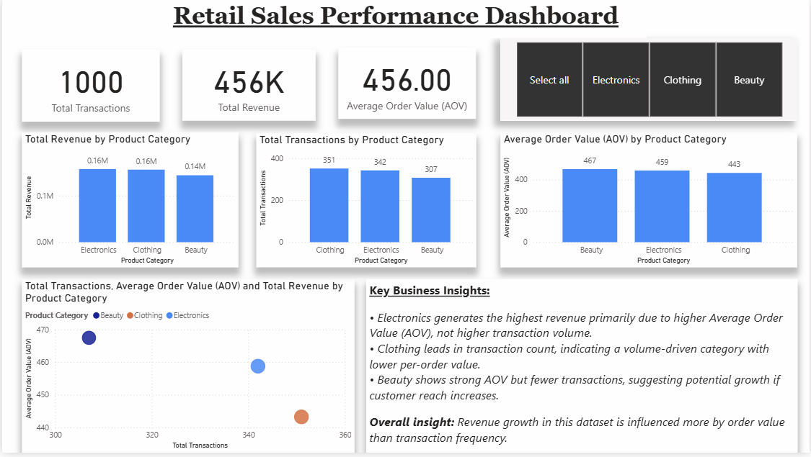

# Retail Sales Performance Analysis (Foundation Project)

## 📌 Project Overview
This project was built as a foundation-level data analytics exercise to strengthen my skills in SQL and Power BI using a retail sales dataset.
## 📊 Dashboard Preview

The goal was to understand how different product categories perform in terms of revenue, transaction volume, and Average Order Value (AOV), and to practice building clean, insight-driven dashboards.

---

## 📊 Dataset Description
The dataset contains retail transaction-level data with the following key fields:
- Product Category (Electronics, Clothing, Beauty)
- Transaction ID
- Quantity
- Price per Unit
- Total Amount
- Customer and demographic attributes

---

## 🎯 Objectives
- Analyze total revenue and transaction trends by product category  
- Calculate key business metrics such as:
  - Total Revenue
  - Total Transactions
  - Average Order Value (AOV)
- Build an interactive Power BI dashboard with slicers and visuals
- Practice basic DAX measures and dashboard storytelling

---

## 🛠 Tools & Technologies
- **SQL** – basic querying and data understanding  
- **Power BI** – data modeling, DAX measures, and dashboard design  
- **GitHub** – project documentation and version control  

---

## 📈 Key Insights
- **Electronics** generates the highest revenue, driven by a higher Average Order Value rather than transaction volume.
- **Clothing** has the highest number of transactions, indicating a volume-driven category with lower per-order value.
- **Beauty** shows a relatively strong AOV but fewer transactions, suggesting potential for targeted growth.

---

## 🖼 Dashboard Preview
*(Dashboard image added below)*

---

## 🚀 Learning Outcome
This project helped me build a strong foundation in:
- Translating raw data into business metrics
- Writing basic DAX measures
- Designing clean and readable dashboards
- Communicating insights clearly using visuals

This project represents my learning journey and foundation in data analytics.
